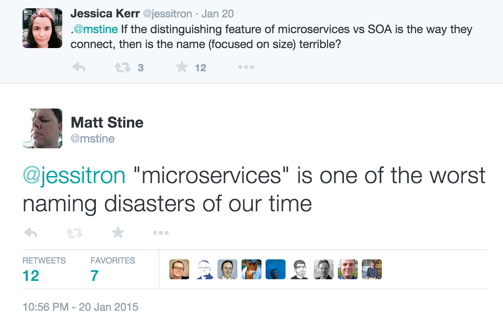
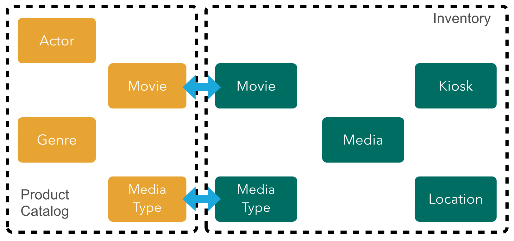
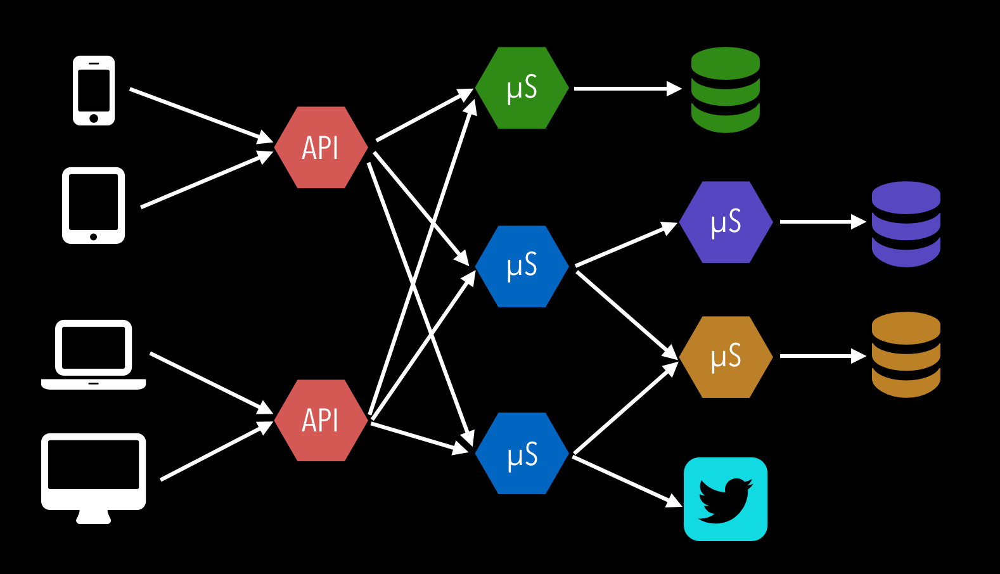
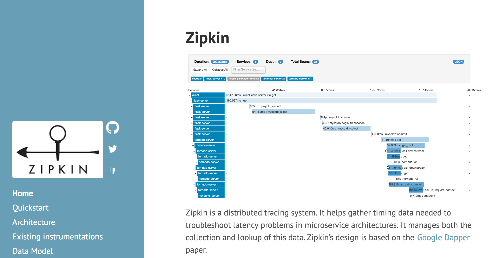

slidenumbers: true

# [fit] Delivering
# [fit] Cloud Native
# [fit] Architectures
# [fit] with Spring Cloud and Cloud Foundry

---

# [fit] FREE

Compliments of Pivotal

[http://bit.ly/cloud-native-book](http://bit.ly/cloud-native-book)

---

Cloud Native Applications compose simple patterns with predictable performance, scaling, security, and failure characteristics to create solutions to complex problems that can be quickly and flexibly adapted to take advantage of new information.

---

# [fit] Why?

---

# [fit] Speed
# [fit] Safety
# [fit] Scale
# [fit] Ubiquity

---

# [fit] What?

---

# What?

- Twelve Factor Apps ([http://12factor.net](http://12factor.net))
- Microservices
- Self-Service Agile Infrastructure
- API-based Collaboration
- Antifragility

---

# [fit] http://12factor.net

---

# Twelve Factors (1/2)

- One Codebase in Version Control
- Explicit Dependencies
- Externalized Config
- Attached Backing Services
- Separate Build, Release, and Run Stages
- Stateless, Shared-Nothing Processes

---

# Twelve Factors (2/2)

- Export Services via Port binding
- Scale Out Horizontally for Concurrency
- Instances Should Be Disposable
- Dev/Prod Parity
- Logs Are Event Streams
- Admin Processes

---

# [fit] Spring Boot
# [fit] https://projects.spring.io/spring-boot/
---

# Twelve Factor Principles

- Immutable Code Artifacts with Externalized Configuration
- Disposable Code Processes with Externalized State
- Identical Process Environments with Externalized Operational Capabilities
- “If microservices are the what, then twelve factor apps are the how.”

---

# MICROSERVICES

---

---

# Define: Microservice
> Loosely coupled service oriented architecture with bounded contexts...
-- Adrian Cockcroft

---

# Loosely Coupled

If every service has to be updated in concert, it’s not loosely coupled!

---

# Bounded Contexts

If you have to know about surrounding services you don’t have a bounded context.

---

# Bounded Contexts

---

# Enabling Continuous Delivery

---

# Enabling Continuous Delivery

---

# Agile: Iterative Feedback Loops

---

# Waterscrumfall

---

# Monolithic Delivery

---

# Conway's Law

> Any organization that designs a system (defined broadly) will produce a design whose structure is a copy of the organization's communication structure.
-- Melvyn Conway, 1967

---

# The Inverse Conway Manuever

---

---

# Continuous Delivery

---

# Supporting Rapid Change

---

> Architecture is abstract until it is operationalized.
-- Neal Ford, 2014

---

> Architectures that aren’t operationalized exist only on whiteboards.
-- Matt Stine, 2014

---

# [fit] Architectural
# [fit] Operationalization

---

# Challenges of Distributed Systems

* Configuration Management
* Service Topology Composition
* Cascading Failures
* Troubleshooting Complex Call Graphs
* API Versioning

---

# Central Configuration Server

---

# Cloud Config Management Bus

---

# Service Discovery

---

# Client-Side Intelligent Load Balancing

---

# Circuit Breaker Pattern

---

# [fit] Spring Cloud
# [fit] http://cloud.spring.io

---

# [fit] https://netflix.github.io

---

# Complex Call Graphs

---

# Distributed Tracing

---

# Zipkin

# http://zipkin.io

---

# [fit] BREAK
# [fit] TIME!
